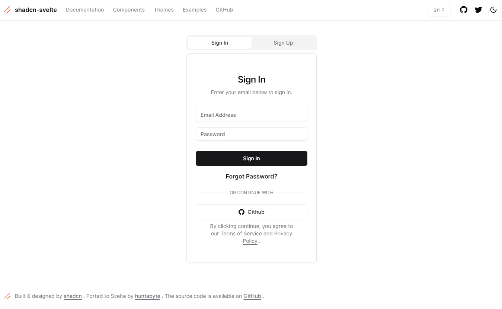

 
 <h1 align="center">
  sveltekit-shadcn-auth-starter
 </h1>

This is a SvelteKit Starter Project with basic user authentication functionality using [Lucia](https://lucia-auth.com/), Prisma, Zod, SuperForms and PostgreSQL:

1. Signin and Signup
2. Mail verification
3. Password reset
4. Profile Page
5. If the user changes their email, send an email to re-verify it.

Additional Feeatures:

1. i18n through [https://inlang.com/](https://inlang.com/)

# Credits

This project is based on 2 wonderful projects [shadcn-svelte](https://www.shadcn-svelte.com/) and [sveltekit-auth-starter](https://github.com/delay/sveltekit-auth-starter)

## Documentation

Visit https://shadcn-svelte.com/docs to view the documentation of the UI components.

## License

Licensed under the [MIT license](https://github.com/shadcn/ui/blob/main/LICENSE.md).
